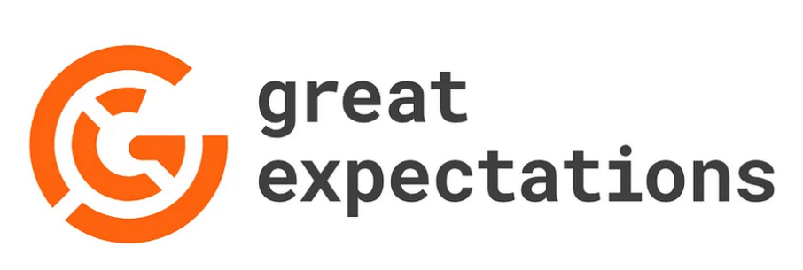
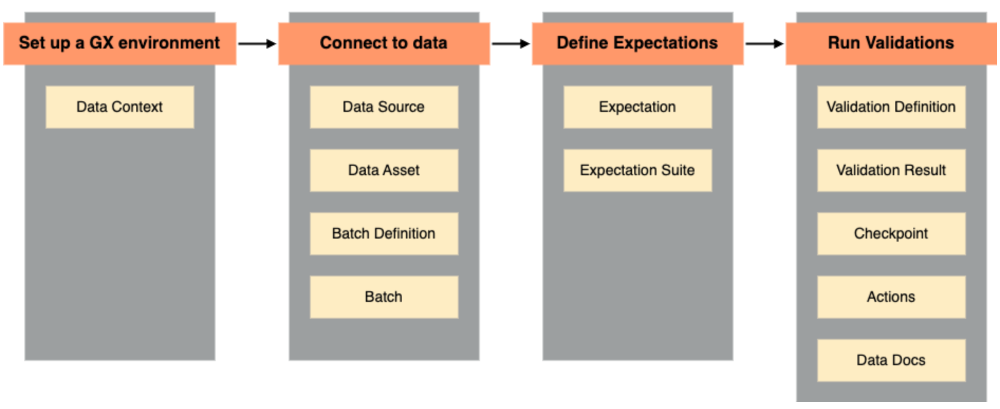

<!-- Improved compatibility of back to top link: See: https://github.com/othneildrew/Best-README-Template/pull/73 -->
<a id="readme-top"></a>
<!--
*** Thanks for checking out the Best-README-Template. If you have a suggestion
*** that would make this better, please fork the repo and create a pull request
*** or simply open an issue with the tag "enhancement".
*** Don't forget to give the project a star!
*** Thanks again! Now go create something AMAZING! :D
-->


<!-- PROJECT SHIELDS -->
<!--
*** I'm using markdown "reference style" links for readability.
*** Reference links are enclosed in brackets [ ] instead of parentheses ( ).
*** See the bottom of this document for the declaration of the reference variables
*** for contributors-url, forks-url, etc. This is an optional, concise syntax you may use.
*** https://www.markdownguide.org/basic-syntax/#reference-style-links
-->
<!-- [![LinkedIn][linkedin-shield]][linkedin-url]
[![Github][github-shield]][github-url] -->


<!-- ABOUT THE PROJECT -->
## About the project

<!-- PROJECT LOGO -->
<br />
<p align="center">
  <a href="https://github.com/HansDoh2404/basic_mongo_db_cluster_with_k8s.git">
  
  </a>
</p>

**Data validation with great_expectations** : This project demonstrates how to use great_expectations to set up rules and validate a dataset before using it in more complex workflow.


## Overview
<br />
<div align="center">
  <a href="https://github.com/HansDoh2404/basic_mongo_db_cluster_with_k8s.git">
  
  </a>
 
  <!-- <p align="center">
    An awesome README template to jumpstart your projects!
    <br />
    <a href="https://github.com/othneildrew/Best-README-Template"><strong>Explore the docs »</strong></a>
    <br />
    <br />
    <a href="https://github.com/othneildrew/Best-README-Template">View Demo</a>
    &middot;
    <a href="https://github.com/othneildrew/Best-README-Template/issues/new?labels=bug&template=bug-report---.md">Report Bug</a>
    &middot;
    <a href="https://github.com/othneildrew/Best-README-Template/issues/new?labels=enhancement&template=feature-request---.md">Request Feature</a>
  </p> -->
</div>

#### Set up a GX environment

You use a **Data Context** to define and run a GX workflow. The Data Context is a Python object that provides access to the configurations, metadata, and actions of your GX workflow components and the results of data validations.

All GX workflows start with the creation of a Data Context.

For more information on the types of Data Context, see Create a [Data Context](https://docs.greatexpectations.io/docs/core/set_up_a_gx_environment/create_a_data_context).
Connect to data

<br/>

A **Data Source** is the GX representation of a data store. The Data Source tells GX how to connect to your data, and supports connection to different types of data stores, including databases, schemas, and data files in cloud object storage.

A **Data Asset** is a collection of records within a Data Source. A useful analogy is: if a Data Source is a relational database, then a Data Asset is a table within that database, or the results of a select query on a table within that database.

A **Batch Definition** tells GX how to organize the records within a Data Asset. The Batch Definition Python object enables you to retrieve a **Batch**, or collection of records from a Data Asset, for validation at runtime. A Data Asset can be validated as a single Batch, or partitioned into multiple Batches for separate validations.

For more information on connecting to data, see [Connect to data](https://docs.greatexpectations.io/docs/core/connect_to_data/).

<br/>

#### Define Expectations

An **Expectation** is a verifiable assertion about data. Similar to assertions in traditional Python unit tests, Expectations provide a flexible, declarative language for describing expected data qualities. An Expectation can be used to validate a Batch of data.

For a full list of available Expectations, see the [Expectation Gallery](https://greatexpectations.io/expectations/).

An **Expectation Suite** is a collection of Expectations. Expectation Suites can be used to validate a Batch of data using multiple Expectations, streamlining the validation process. You can define multiple Expectation Suites for the same data to cover different use cases, and you can apply the same Expectation Suite to different Batches.

For more information about defining Expectations and creating Expectation Suites, see [Define Expectations](https://docs.greatexpectations.io/docs/core/define_expectations/).

#### Run Validations

A **Validation Definition** explicitly associates a Batch Definition to an Expectation Suite, defining what data should be validated against which Expectations.

A **Validation Result** is returned by GX after data validation. The Validation Results tell you how your data corresponds to what you expected of it.

A **Checkpoint** is the primary means for validating data in a production deployment of GX. Checkpoints enable you to run a list of Validation Definitions with shared parameters. Checkpoints can be configured to run Actions, and can pass Validation Results to a list of predefined Actions for processing.

**Actions** provide a mechanism to integrate Checkpoints into your data pipeline infrastructure by automatically processing Validation Results. Typical use cases include sending email alerts, Slack/Microsoft Teams messages, or custom notifications based on the result of data validation.

**Data Docs** are human-readable documentation generated by GX that host your Expectation Suite definitions and Validation Results. Using Checkpoints and Actions, you can configure your GX workflow to automatically write Validation Results to a chosen Data Docs site.

For more information on defining and running Validations, see [Run Validations](https://docs.greatexpectations.io/docs/core/run_validations/).

## Quickstart

1. Clone the repo
   ```sh
   git clone https://github.com/HansDoh2404/data_validation_with_great_expectations.git 
   ```

2. Launching the data validation process :
   ```sh
   python3 main.py
   ```

3. Visualize the different expectations matching the dataset in the browser

4. Go to the expectations file for adding, removing or modifying rules

5. Go to the utils file for modifying the suite

<!-- CONTACT -->
## Contact

Contributor : [@Hans Ariel](https://www.linkedin.com/in/hans-ariel-doh-59a31a2ba/) - hansearieldo@gmail.com
<br />
Project link: https://github.com/HansDoh2404/data_validation_with_great_expectations.git  


<!-- ACKNOWLEDGMENTS -->
## Useful

[great_expectations documentation](https://docs.greatexpectations.io/docs/core/introduction/gx_overview) : full documentation about great_expectations

